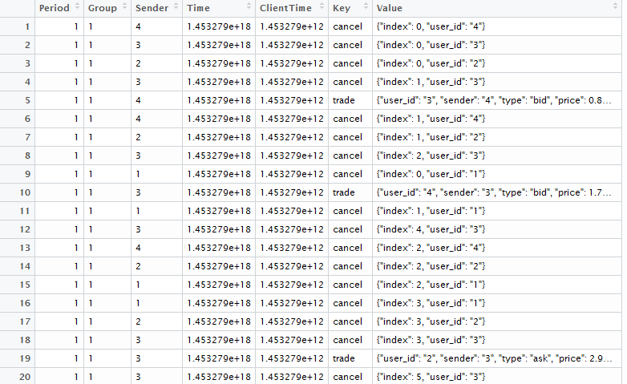
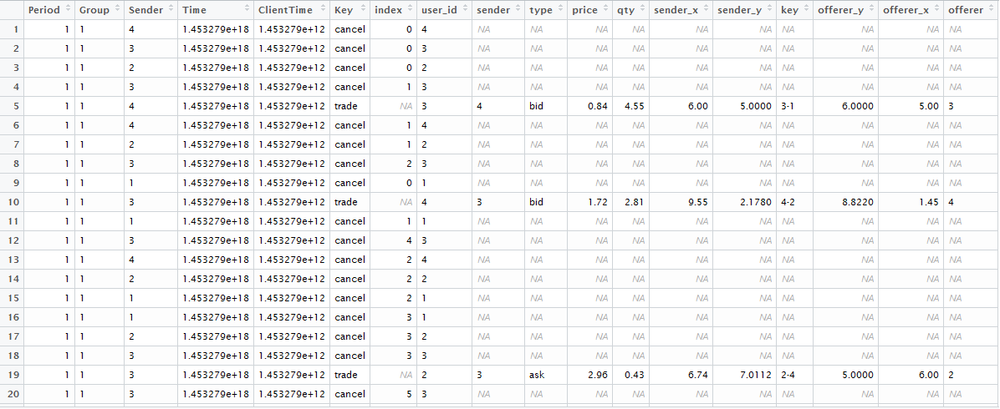

# Redwood Output Data Parser
Tools for wrangling Redwood output data

email: curtis.kephart@gmail.com

# redwoodParser

Use function `redwoodParser`. 

Given output data, as a CSV with columns `Period`,	`Group`,	`Sender`,	`Time`,	`ClientTime`, `Key`, and `Value`,
this function expands all key-value combinations in the `Value` column to a separate column. 

If a particular row doesn't contain a particular key-value combination, `NA` results. 


### Arguments

- **`data`**: an Redwood experiment output file read into r as a data frame.

- **`keys`**: the keys under the `Key` column you wish to keep. All others are dropped. 


### Dependencies 

Requires  r packages `jsonlite` and `dplyr`.

### For Example

From this: `testData <- read.csv("ExperimentData.csv")`




To this: 

```{r}
 testData <- redwoodParser(data = testData,
             keys = c("trade", "cancel","offer_text"))
```

